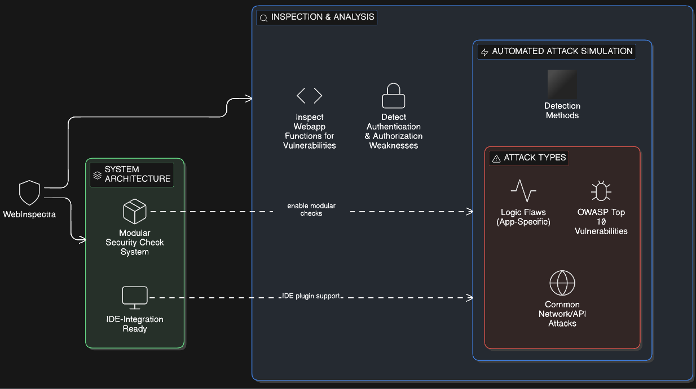

# WebInspectra-Application-Security-Code-Inspector
I built WebInspectra, a developer-focused security inspection framework designed to analyze running web applications for vulnerabilities using automated attack simulation and modular security checks, with an architecture ready for future IDE integration.

***

   

***

# Feature
- Inspect application functions for vulnerabilities
- Automated attack simulation against running endpoints
- Detect webapp threats and logic flaws
- Modular security check system
- Vulnerable and secure demo applications
- IDE integration ready architecture
