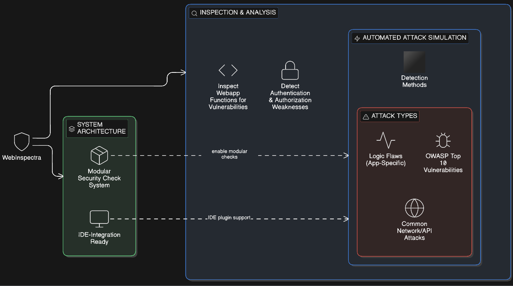

# Codexaegis-Application-Security-Code-Inspector
I built Codexaegis, a developer-focused security inspection framework designed to analyze running web applications for vulnerabilities using automated attack simulation and modular security checks, with an architecture ready for future IDE integration. 
  
***
<div align="center">
   
</div>

***

# Feature
- Inspect application functions for vulnerabilities
- Automated attack simulation against running endpoints
- Detect webapp threats and logic flaws
- Modular security check system
- Vulnerable and secure demo applications
- IDE integration ready architecture

# Workflow

## Phase 1: Build the app ( [app.py](https://github.com/uAckerman/Codexaegis-Application-Security-Code-Inspector/blob/main/app.py) )

I built a simple Flask based web application to demonstrate how authentication systems work and how common security vulnerabilities can occur if secure coding practices are not followed.

The application uses **Flask** as the backend framework and **SQLite** as the database. When the app runs for the first time, it automatically initializes a database file (**database.db**) and creates a users table with fields for id, username, and password. It also inserts a default user (**admin / admin123**) for testing purposes.


***
 
  
***
> I enhance the login page with some custom styling
***
 

***

## Phase 2: Build the Inspection Engine Core ( [controller.py](https://github.com/uAckerman/Codexaegis-Application-Security-Code-Inspector/blob/main/controller.py) )

In this step, i create the main engine that runs security checks on a website. It manages all security checks on a website.

**What the Code Does:**

| Method | Description |
|------|-------------|
| `__init__(base_url)` | Saves the target website URL and creates an empty list to store security checks |
| `register_check(check)` | Adds a security check (like SQL Injection) to the list |
| `run()` | Runs all registered checks on the target URL and collects their results |

 ## Phase 3: Create the SQL Injection Detection Logic ( [sql_injection.py](https://github.com/uAckerman/Codexaegis-Application-Security-Code-Inspector/blob/main/sql_injection.py) )

The **SQLInjectionCheck** module is designed to test whether a web application login functionality is vulnerable to SQL Injection.   
- In the first step, the module attempts the attack by sending a crafted payload
  ```
   "username": "' OR '1'='1",  
   "password": "' OR '1'='1"
  ```
  to the login endpoint using an HTTP POST request. This payload is commonly used to manipulate SQL queries and attempt to bypass authentication    by commenting out the rest of the query.
- In the second step, the module tests the response from the server. It checks whether the response contains the message “Login Successful.” If this message appears, it indicates that the SQL Injection attempt may have successfully bypassed the login mechanism, marking the system as VULNERABLE. If the login is not bypassed, the result is marked as SAFE. If any exception occurs during the request, the module returns an ERROR status along with the error details.
